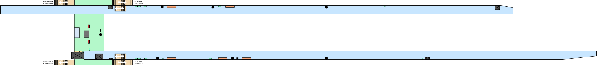

# MTA PlatformPath

An interactive, station-level navigation prototype for the New York City subway.

PlatformPath helps riders navigate the parts of a station that a typical transit map does not show: platforms, stairs, mezzanines, fare-control areas, and street exits. Select a start and end point, then follow step-by-step directions on an interactive SVG station map.



## Features

- **Interactive station maps** — pan and zoom detailed SVG station diagrams.
- **Step-by-step routing** — find a route between station nodes using a graph-based pathfinder.
- **Layer-aware navigation** — view station levels individually or together.
- **Route previews** — highlight selected start/end nodes before beginning navigation.
- **Directional instructions** — graph edges store instructions for both travel directions.
- **Line and station discovery** — browse subway lines, stations, and individual station maps.
- **REST API** — serves lines, stations, layers, nodes, and edges to the TypeScript frontend.

## Current Coverage

The project currently includes interactive station data for:

- Bay 50 St (`D`)
- 25 Av (`D`)

The data model and seed structure are designed so additional stations can add their own diagrams, layers, nodes, and routes.

## How It Works

Each station is represented as a graph:

```text
Station
 ├── Layers
 │    ├── Platforms
 │    └── Mezzanine
 ├── Nodes
 │    ├── Platform sections
 │    ├── Stairs
 │    ├── Exits
 │    └── Mezzanine areas
 └── Edges
      └── Bidirectional walking connections and instructions
```

Each node stores an SVG element ID. When a route is calculated, the frontend maps each graph node to its corresponding SVG element, shows the appropriate station layer, highlights the current location, and centers the map on that point.

## Tech Stack

- **Backend:** Django + Django REST Framework
- **Frontend:** TypeScript, HTML, CSS
- **Database:** SQLite for local development
- **Map rendering:** Inline SVG with [`panzoom`](https://github.com/anvaka/panzoom)
- **Routing:** Breadth-first search over station nodes and edges

## Getting Started

### Prerequisites

- Python 3.12+
- Node.js and npm
- Git

### 1. Clone the repository

```bash
git clone https://github.com/holeedays/MTA-PlatformPath.git
cd MTA-PlatformPath
```

### 2. Create and activate a Python virtual environment

```bash
python -m venv .venv
```

**Windows PowerShell**

```powershell
.venv\Scripts\Activate.ps1
```

**macOS / Linux**

```bash
source .venv/bin/activate
```

### 3. Install Python dependencies

```bash
pip install -r requirements.txt
```

### 4. Configure the Django secret key

Create `platformpath/.env`:

```env
SECRET_KEY=replace-this-with-a-local-development-secret
```

### 5. Install frontend dependencies

```bash
cd platformpath
npm install
```

### 6. Compile TypeScript

```bash
npx tsc
```

The generated JavaScript files are placed in `platformpathapp/static/platformpathapp/js/`.

### 7. Run migrations and seed station data

```bash
python manage.py migrate
python manage.py seed_stations
```

> **Note:** `seed_stations` clears and recreates the project’s station, line, layer, node, and edge data.

### 8. Start the development server

```bash
python manage.py runserver
```

Open [http://127.0.0.1:8000/](http://127.0.0.1:8000/) in your browser.

## Main Routes

| Route | Purpose |
|---|---|
| `/` | Project landing page |
| `/discover/lines/` | Browse subway lines |
| `/discover/lines/<line>/stations/` | Browse stations on a line |
| `/discover/lines/<line>/stations/<station>/map/` | Interactive station map |
| `/api/lines/` | Available subway lines |
| `/api/lines/<line_id>/stations/` | Stations on a selected line |
| `/api/stations/<station_id>/edges_nodes/` | Station graph and layer data |

## Project Structure

```text
MTA-PlatformPath/
├── platformpath/
│   ├── manage.py
│   ├── platformpath/                 # Django project configuration
│   └── platformpathapp/
│       ├── management/
│       │   ├── commands/              # Database seed commands
│       │   └── stations/              # Station-specific graph data
│       ├── static/platformpathapp/
│       │   ├── diagrams/              # Station SVG diagrams
│       │   ├── ts/                    # TypeScript source
│       │   ├── js/                    # Generated JavaScript
│       │   └── css/                   # Page styling
│       ├── templates/                 # Django templates
│       ├── models.py                  # Graph and transit data models
│       ├── views.py                   # Page views
│       └── views_api_new.py           # REST API views
├── requirements.txt
└── README.md
```

## Adding a Station

To add a new station:

1. Add an SVG diagram to `platformpathapp/static/platformpathapp/diagrams/`.
2. Create a station seed module in `platformpathapp/management/stations/`.
3. Define the station’s transit lines, layers, nodes, SVG IDs, edges, and directions.
4. Import and call the new seed module from `seed_stations.py`.
5. Re-run:

```bash
python manage.py seed_stations
```

## Development Notes

- SVG IDs and seeded node `svg_id` values must match exactly.
- Run `npx tsc` after changing files in `static/platformpathapp/ts/`.
- Generated JavaScript files are ignored by Git, so developers compile TypeScript locally.
- The current map UI is actively being refined, including responsive controls and station-layer navigation.

## Developers

| Name | Role / Contribution | Contact |
|---|---|---|
| Edmond Huang | Project Lead | [GitHub profile](https://github.com/holeedays) |
| Ivan Yeung | Project Contributor | [GitHub profile](https://github.com/IvanYeung0610) |

## Demo Asset

A project video is available here:

[`MTA_PlatformPath_HomePage_Display.mp4`](platformpath/platformpathapp/static/platformpathapp/videos/MTA_PlatformPath_HomePage_Display.mp4)

## License

No license has been specified yet.
